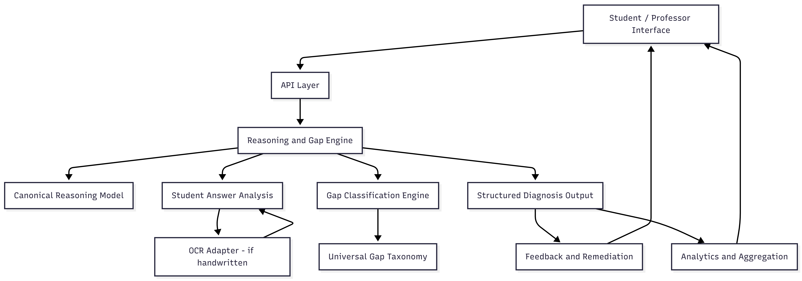

# Study-Buddy - Cognitive Gap Detection System

This project is developed as a senior capstone project in Computer Science.It is an end-to-end AI system that analyzes student answers, identifies **why** they are wrong (not just whether), classifies cognitive gaps using a **universal gap taxonomy**, and provides actionable remediation.

The same core reasoning engine supports both **students** and **professors**, with role-specific interfaces and aggregated analytics.

---

## Problem Statement

Most educational tools focus on **grading correctness** or **content generation**.  
They fail at the hardest and most valuable problem:

> Diagnosing reasoning gaps and explaining what is missing in a student’s understanding.

As a result:
- Students repeat mistakes without understanding the root cause
- Professors lack visibility into systemic misconceptions
- Feedback is shallow, generic, or purely score-based

This project addresses that gap.

---

## Core Idea

The system is built around a **single reasoning and gap-analysis engine** that:

1. Compares a student’s answer to a canonical reasoning process  
2. Identifies **types of cognitive gaps** (conceptual, procedural, intuition, incomplete understanding)  
3. Explains what is missing and how to fix it  
4. Aggregates gaps across students to reveal class-level weaknesses  

Handwritten answers are supported via OCR as a **preprocessing adapter**, but all reasoning is performed on text.

---

## Universal Gap Taxonomy

All analyses are expressed using a domain-agnostic taxonomy.

### Conceptual Confusion
- Confusing related concepts within a domain  
- Examples:
  - Heap vs BST
  - TCP vs UDP
  - Database normalization forms

### Procedural Application Gap
- Knows the concept but cannot apply it correctly  
- Examples:
  - Incorrect algorithm steps
  - Failure to trace execution
  - Inability to translate concept into procedure

### Intuition / “Why” Gap
- Correct answer without correct reasoning  
- Memorization without understanding  
- Inability to justify decisions

### Incomplete Understanding (Modifier)
- Partial reasoning
- Missing steps or edge cases  
- Can co-exist with other gap types

Multiple gap types may apply to a single answer.

---

## System Architecture



flowchart TD
A[Student / Professor Interface] --> B[API Layer]
B --> C[Reasoning & Gap Engine]

C --> D[Canonical Reasoning Model]
C --> E[Student Answer Analysis]
C --> F[Gap Classification Engine]

E --> G[OCR Adapter<br/>(if handwritten)]
G --> E

F --> H[Universal Gap Taxonomy]

C --> I[Structured Diagnosis Output]
I --> J[Feedback & Remediation]
I --> K[Analytics & Aggregation]

J --> A
K --> A


The system follows a clean, layered architecture:

Frontend (Student / Professor)
|
v
API Layer (FastAPI)
|
v
Reasoning & Gap Engine (LLM-based)
|
v
Data Layer (Courses, Answers, Gaps)

OCR is treated as a **lossy input adapter**, not part of the core intelligence.

---

## Key Features

### Professor Features
- Upload course materials (PDFs / slides)
- Generate practice questions
- Generate exams
- Analyze student answers using the gap taxonomy
- View aggregated analytics:
  - Most frequent misconceptions
  - Concept-level failure rates
  - Distribution of gap types

### Student Features
- Request practice questions or mock exams
- Submit answers (typed text or handwritten images)
- Receive structured feedback explaining:
  - What is missing in the reasoning
  - Which concepts need revision
  - How to improve understanding

---

## OCR Support (Scoped)

Handwritten answers are supported under explicit constraints:

- Text-only handwriting
- Single language
- No diagrams
- No complex mathematical notation

OCR output is treated as **best-effort text**.  
Uncertainty is tolerated and handled downstream by the reasoning engine.

---

## Core Intelligence: Reasoning & Gap Engine

The heart of the system is a structured LLM-based reasoning diagnosis pipeline.

### Inputs
- Question
- Canonical solution (expected reasoning steps + required concepts)
- Student answer (typed or OCR output)
- Relevant course context

### Output (Structured JSON)
```json
{
  "correctness": "incorrect",
  "gap_types": ["Conceptual Confusion", "Procedural Application Gap"],
  "missing_concepts": ["heap property"],
  "misconceptions": [
    {
      "concept": "heap vs BST",
      "explanation": "The student assumes ordering guarantees..."
    }
  ],
  "incomplete": true
}

